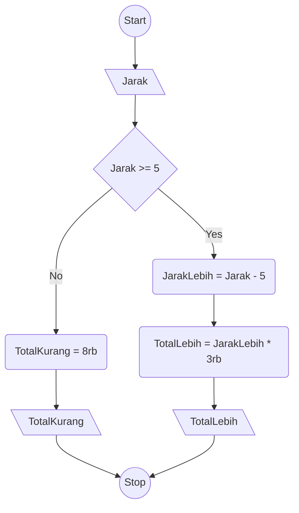

# FLOWCHART Ongkos Kirim

```mermaid
flowchart TD
Start((Start))
Input[\Jarak\]
Decision{Jarak >= 5}
JarakLebih(JarakLebih = Jarak - 5)
ProcessLebih(TotalLebih = JarakLebih * 3rb)
ProcessKurang(TotalKurang = 8rb)
TerminatorLebih[\TotalLebih\]
TerminatorKurang[\TotalKurang\]
Stop((Stop))

Start --> Input
Input --> Decision
Decision -- Yes --> JarakLebih
Decision -- No --> ProcessKurang
JarakLebih --> ProcessLebih
ProcessKurang --> TerminatorKurang
ProcessLebih --> TerminatorLebih
TerminatorKurang --> Stop
TerminatorLebih --> Stop
```
