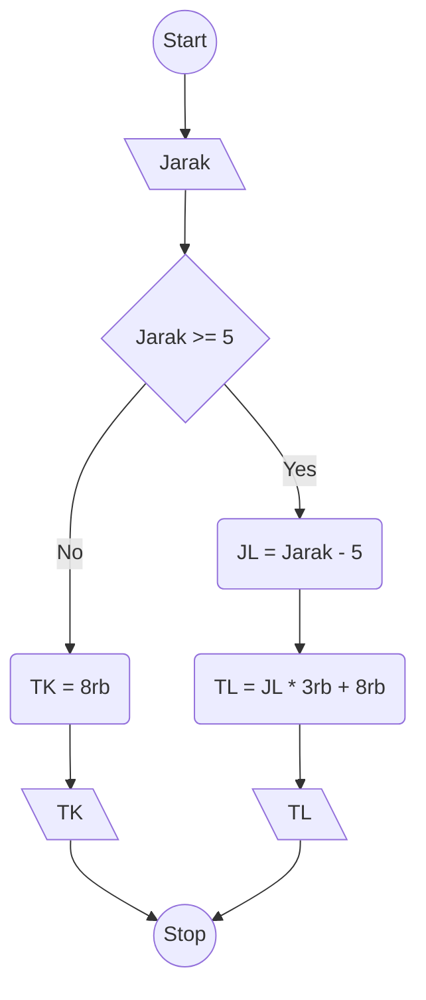

# FLOWCHART Ongkos Kirim

```mermaid
flowchart TD
Start((Start))
Input[\Jarak\]
Decision{Jarak >= 5}
JL(JL = Jarak - 5)
ProcessLebih(TL = JL * 3rb + 8rb)
ProcessKurang(TK = 8rb)
TerminatorLebih[\TL\]
TerminatorKurang[\TK\]
Stop((Stop))

Start --> Input
Input --> Decision
Decision -- Yes --> JL
Decision -- No --> ProcessKurang
JL --> ProcessLebih
ProcessKurang --> TerminatorKurang
ProcessLebih --> TerminatorLebih
TerminatorKurang --> Stop
TerminatorLebih --> Stop
```
