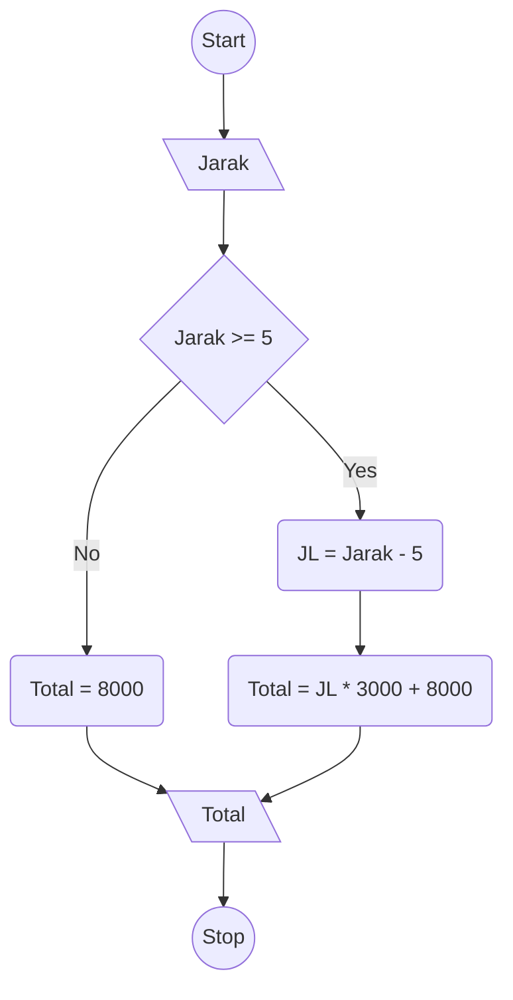

# FLOWCHART Ongkos Kirim

```mermaid
flowchart TD
Start((Start))
Input[\Jarak\]
Decision{Jarak >= 5}
JL(JL = Jarak - 5)
ProcessLebih(Total = JL * 3000 + 8000)
ProcessKurang(Total = 8000)
Total[\Total\]
Stop((Stop))

Start --> Input
Input --> Decision
Decision -- Yes --> JL
Decision -- No --> ProcessKurang
JL --> ProcessLebih
ProcessKurang & ProcessLebih  --> Total
Total --> Stop
```
