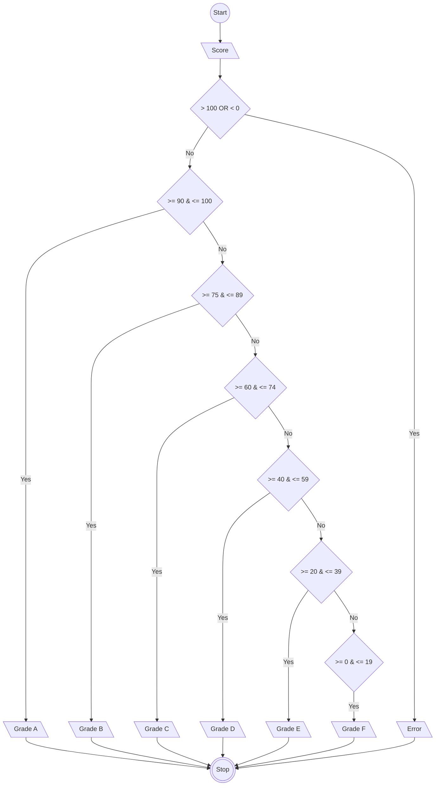

# FlowChart Score

```mermaid
flowchart TD

Start((Start))
Input[\Score\]
CetakErrro{ > 100 OR  < 0}
CekA{ >= 90 &  <= 100}
CekB{ >= 75 &  <= 89}
CekC{ >= 60 &  <= 74}
CekD{ >= 40 &  <= 59}
CekE{ >= 20 &  <= 39}
CekF{ >= 0 &  <= 19}

A[\Grade A\]
B[\Grade B\]
C[\Grade C\]
D[\Grade D\]
E[\Grade E\]
F[\Grade F\]
Error[\Error\]

Stop(((Stop)))

Start --> Input
Input --> CetakErrro
CetakErrro -- Yes --> Error
CetakErrro -- No --> CekA
CekA -- Yes --> A
CekA -- No --> CekB
CekB -- Yes --> B
CekB -- No --> CekC
CekC -- Yes --> C
CekC -- No --> CekD
CekD -- Yes --> D
CekD -- No --> CekE
CekE -- Yes --> E
CekE -- No --> CekF
CekF -- Yes --> F

A --> Stop
B --> Stop
C --> Stop
D --> Stop
E --> Stop
F --> Stop
Error --> Stop


```
