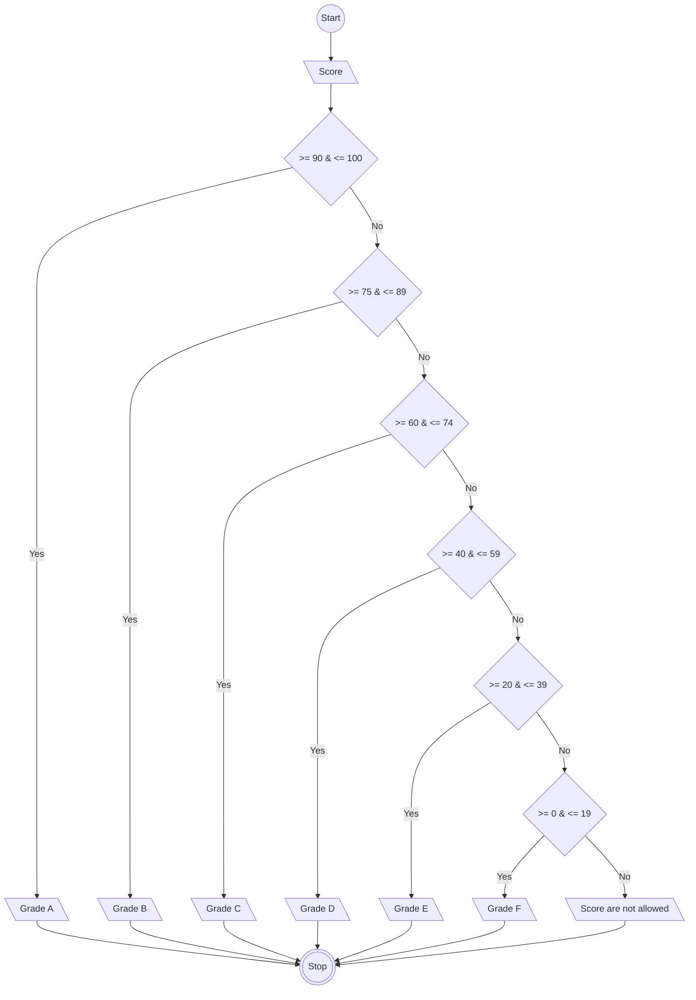

# FlowChart Score

```mermaid
flowchart TD

Start((Start))
Input[\Score\]
CekA{>= 90 & <= 100}
CekB{>= 75 & <= 89}
CekC{>= 60 & <= 74}
CekD{>= 40 & <= 59}
CekE{>= 20 & <= 39}
CekF{>= 0 & <= 19}
Error[\Score are not allowed\]

A[\Grade A\]
B[\Grade B\]
C[\Grade C\]
D[\Grade D\]
E[\Grade E\]
F[\Grade F\]


Stop(((Stop)))

Start --> Input
Input --> CekA
CekA -- Yes --> A
CekA -- No --> CekB
CekB -- Yes --> B
CekB -- No --> CekC
CekC -- Yes --> C
CekC -- No --> CekD
CekD -- Yes --> D
CekD -- No --> CekE
CekE -- Yes --> E
CekE -- No --> CekF
CekF -- Yes --> F
CekF -- No --> Error
Error --> Stop

A --> Stop
B --> Stop
C --> Stop
D --> Stop
E --> Stop
F --> Stop


```