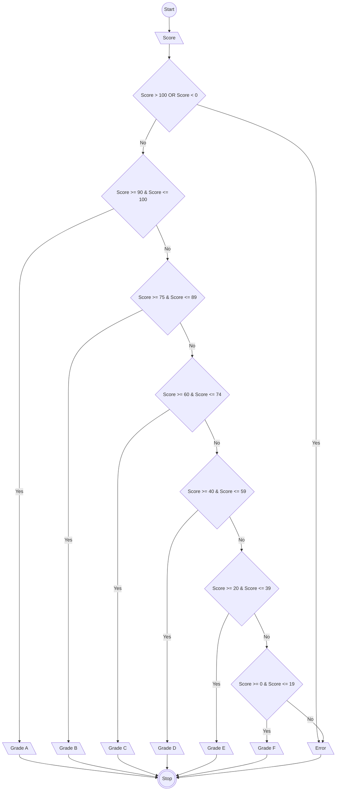

# FlowChart Score

```mermaid
flowchart TD

Start((Start))
Input[\Score\]
CetakErrro{ Score > 100 OR Score < 0}
CekA{Score >= 90 & Score <= 100}
CekB{Score >= 75 & Score <= 89}
CekC{Score >= 60 & Score <= 74}
CekD{Score >= 40 & Score <= 59}
CekE{Score >= 20 & Score <= 39}
CekF{Score >= 0 & Score <= 19}

A[\Grade A\]
B[\Grade B\]
C[\Grade C\]
D[\Grade D\]
E[\Grade E\]
F[\Grade F\]
Error[\Error\]

Stop(((Stop)))

Start --> Input
Input --> CetakErrro
CetakErrro -- Yes --> Error
CetakErrro -- No --> CekA
CekA -- Yes --> A
CekA -- No --> CekB
CekB -- Yes --> B
CekB -- No --> CekC
CekC -- Yes --> C
CekC -- No --> CekD
CekD -- Yes --> D
CekD -- No --> CekE
CekE -- Yes --> E
CekE -- No --> CekF
CekF -- Yes --> F
CekF -- No --> Error


A --> Stop
B --> Stop
C --> Stop
D --> Stop
E --> Stop
F --> Stop
Error --> Stop


```
