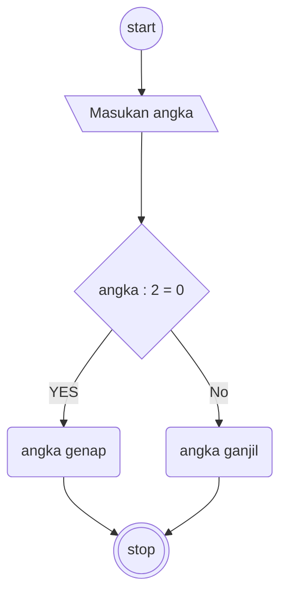

# FLowchart menentukan bilangan ganjil atau genap

```mermaid
flowchart TD
Start((start))
InputAngka[\Masukan angka\]
Perhitungan{angka : 2 = 0}
ProsessGanjil(angka ganjil)
ProsessGenap(angka genap)
Stop(((stop)))

Start --> InputAngka
InputAngka ---> Perhitungan
Perhitungan -- YES --> ProsessGenap --> Stop
Perhitungan -- No --> ProsessGanjil --> Stop

```
