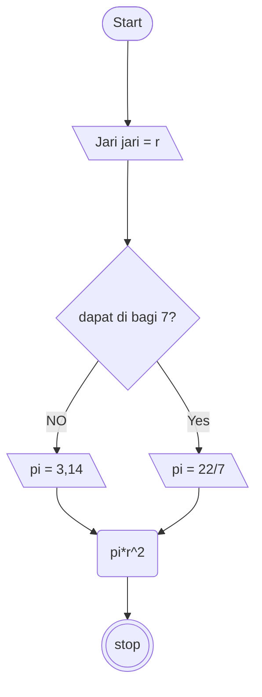
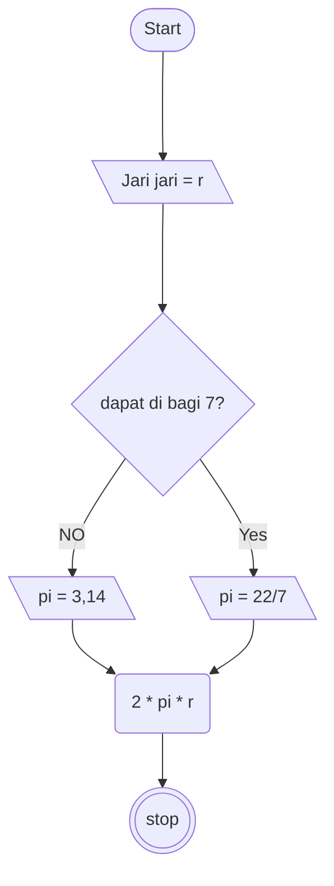

# FLowchart menentukan luas dan keliling lingkaran
## Menghitung luas

```mermaid
flowchart TD
Start([Start])
Input[\Jari jari = r\]
Decision{dapat di bagi 7?}
R1[\pi = 3,14\]
R2[\pi = 22/7\]
Perhitungan(pi*r^2)
Stop([Stop])

Start ---> Input
Input ---> Decision 
Decision -- NO --> R1
Decision -- Yes --> R2
R1 & R2 --> Perhitungan
Perhitungan --> Stop
Stop(((stop)))
```

## Menghitung keliling

```mermaid
flowchart TD
Start([Start])
Input[\Jari jari = r\]
Decision{dapat di bagi 7?}
R1[\pi = 3,14\]
R2[\pi = 22/7\]
Perhitungan(2 * pi * r)
Stop([Stop])

Start ---> Input
Input ---> Decision 
Decision -- NO --> R1
Decision -- Yes --> R2
R1 & R2 --> Perhitungan
Perhitungan --> Stop
Stop(((stop)))
```